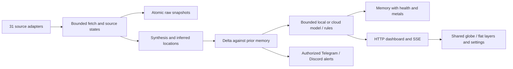

# Crucix teljes kódaudit és fejlesztések — 2026. október 1.

A kiinduló fork `ef579d1`, az összehasonlított upstream `3db7068`. A teljes eredeti termékkód, konfiguráció, tesztek és kapcsolódó szöveges dokumentáció statikus ellenőrzést kapott: 90 fájl; a 95 követett fájlból csak a LICENSE és négy referencia-PNG maradt ki. Titkos konfiguráció, felhasználói futási adatok és külső PR-kód nem került futtatásra az audit során. A javításokat célzott regressziókkal és külön felülvizsgálattal ellenőriztük.

Az upstream **104 PR-jának és 50 issue-jának egyedi döntése** a [részletes jelentésben](upstream-review-2026-10-01.md) és a [gépileg olvasható döntési jegyzékben](upstream-decisions-2026-10-01.json) található. A lista nyitott és lezárt tételeket is tartalmaz. A nagy forkok teljes diffje leltározott, kritikus termékrészei célzottan vizsgáltak; ez nem az egész alternatív termék minden sorának viselkedési igazolása. Semmit nem merge-eltünk vakon. A #27 PR obfuszkált kódfuttató payloadját kizártuk; a támadó személyére vonatkozó állításokat nem igazoltuk.

Az upstream master 31 merge-elt PR-jából 29 a kiinduló fork történetének része volt. A tényleges master-többlet a #98 és #99: Gemini thinking/válasz- és budget-kezelés, valamint Discord ötletértesítés. Ezek hasznos részeit a 2.2 kiadásban adaptáltuk. A többi nyitott vagy merge nélkül lezárt PR új ötlet vagy javításjavaslat, nem automatikusan az eredeti master funkciója. A saját fork már a baseline-ban magyar felületet, IODA-t, WHO/HDX kiegészítést és mentett panelrendezést tartalmazott. Záró GitHub-lekérdezés: továbbra is 104 PR, 50 issue és ugyanaz a `3db7068` upstream HEAD.

## Fontosabb hibák és megoldások

| Prioritás | Kiinduló hiba és hatás | Megoldás, hely | Bizonyíték |
| --- | --- | --- | --- |
| P0, high | A hírszöveg whitespace-es closing script taggel megszakíthatta az inline JSON-t; a CLI még az egyszerű lezárást sem kezelte | Közös `<`-escaping a [HTML helperben](../../lib/html.mjs), szerver/CLI/locale használat; 2.1 | Nested JSON round-trip és tagvariáns regresszió |
| P0, high | SDR-nevek, headline-ok és LLM-mezők aktív HTML/attribútum sinkbe kerültek | Kontextusos escaping, popup textContent, enum és mezővalidáció; 2.1/2.2 | Ticker/idea/link payload-tesztek; böngészős fixture |
| P1, medium | Discord felhasználó külső csatornából vagy normál tagsággal némíthatta az értesítéseket, sweepet kérhetett | Guild/channel gate, explicit userlista vagy Manage Server/Admin; 2.1 | Tiltott csatorna és tagság negatív teszt |
| P1, medium | Telegram kontrollbot privát üzenete OSINT-adatként a dashboardba/model contextbe kerülhetett | Bot-update ingestion eltávolítása, public preview opt-in; 2.1 | Kontrolltoken nem indít forrásfetch-et |
| P2, low | ACLED --debug hitelesítési headereket/fragments írt ki | Credential-redacted log és body nélküli auth-hibák; 2.1/2.2 | Eredeti source trace és javított ág külön ellenőrzése; éles titkot nem olvastunk |
| P1 | Fetch timeout a headers után megszűnt; body elakadhatott, timer maradhatott | Teljes body deadline, finally cleanup, bounded streaming, HTTP-state retry; [fetch utility](../../apis/utils/fetch.mjs); 2.2 | Valódi helyi HTTP stalled-body, chunked-size és 429 fixture |
| P1 | OFAC több hatalmas XML-t teljes egészében töltött le, non-JSON truncation hibás számlálást adott | Két, max. 64 KiB-os sample; explicit partial és hiteles count; 2.2 | Range-ignored/oversized-chunk/unbounded-stream/cancel tesztek |
| P1 | NOAA nem támogatott limit; sok adapter hiba után „0 adat, siker” állapotot jelzett | API paraméter javítás, top/nested/alias/status hiba számlálása; WHO, KiwiSDR, USAspending, EPA, Treasury, Yahoo regressziók; 2.2 | Hibás, malformed és valóban üres válasz külön tesztelve |
| P1 | OpenSky korlátlan múltbeli cache; részhiba friss regionális adatot is régi adattal cserélt | Egyórás TTL, érvényes observation idő, timestamp alapú választás, friss részadat megőrzése; 2.2 | Invalid/future/expired/missing timestamp és partial-air fixture |
| P1 | RSS véletlen jitter és kiadó-középpont cikkhelynek álcázva; GDELT mindig „most” | Stabil inferred hely, ismeretlen hely a tickerben; valós provider idő, invalid calendar `null`; 2.2/2.3 | Determinisztikus repeated-news és compact/ISO dátum teszt |
| P1 | LLM prompt undefined delta mezőket használt; szabályötletek dead code-ként maradtak | `from/to/pctChange`, dinamikus forráslétszám, egységes bounded schema és HU/EN fallback; 2.2 | Model mock, parser, rules, null/zero és momentum tesztek |
| P1 | LLM budgetet a call-site felülírta; reasoning-only válasz üres sikert adott | Érvényesített ideas/alerts token/deadline, Gemini thought-filter, finish_reason diagnózis; 2.2 | Provider request mock és thinking-only exhaustion teszt |
| P1 | Memória az ötletek előtt mentett; health/metals elveszett, változatlan forráshiba új riasztást okozott | Delta a korábbi run ellen; ötletek után mentés; health/metals tárolás, backup-validáció; 2.2 | Újratöltött memória és változatlan degradation regresszió |
| P1 | Érvénytelen/ötjegyű port banner hibát okozott; LAN célközönség nem volt ténylegesen korlátozva | Szigorú integer, safe repeat, localhost, választható Basic, valid HTTP(S) PUBLIC_URL; 2.1/2.2 | Valódi process-start, auth/API/SSE HTTP teszt |
| P1 | Induló lassú API-válasz a friss SSE után régebbi adatot írhatott vissza | Snapshot időbélyeg monoton ellenőrzése, azonos idő elfogadható; 2.3 | Valódi késleltetett API/frissebb SSE Playwright regresszió; a javítás előtt megbukott |
| P2 | Sok marker és animélt HUD nehezen áttekinthető; kevés állapotjelzés | Közös rétegkatalógus, live/frissesség, elkülönített empty/error/disabled/stale, accessible settings és mobile; 2.3 | Asztali/mobil böngésző-QA |

A biztonsági scan az eredeti commiton **2 high, 2 medium, 1 low** findinget rögzített. Ezek nem a javított végső HEAD aktív hibáinak számát jelentik. A publikus OSINT-felület önmagában nem igazolt adatszivárgás; a privát Telegram út volt a konkrét kivétel. Nem találtunk request-controlled path traversal vagy távoli shell/tool-RCE útvonalat. Operátor által megadott model URL nem önmagában SSRF. Ezek vizsgált és elutasított hipotézisek, nem általános biztonsági garanciák.

## Design és UX

A meglévő Jarvis-megjelenést, magyar felületet, IODA/WHO/HDX adatokat és mentett panelrendezést megtartottuk. A javítás a használhatósági problémákra koncentrál: a rétegek egy helyen kapcsolhatók, a térkép/globe ugyanazt a beállítást követi, a hiányzó adatot nem kell a felhasználónak nulla értékből kitalálnia. A beállítások fókusza és bezárása billentyűzettel is működik; a mozgás csökkenthető, mobilon a panelek elérhetők.

A legjobb következő termékfejlesztés egy esemény részletező nézet lenne: eredeti forráslink, observed/published/collected idő, geolokáció módja és megerősítő források együtt. Ez több hasznot adhat, mint új díszítő animáció. Második lépés lehet a kereshető hír-/jelzéstörténet és export; harmadik egy mentett „kutatás/piac/infrastruktúra” panelprofil. Ezek új termékfunkciók, nem a most javított hibákhoz szükséges változások.

## Hasonló projektekből átvehető minták

| Elsődleges forrás | Hasznos minta | Crucix döntés |
| --- | --- | --- |
| [World Monitor](https://github.com/koala73/worldmonitor) | Közös flat/globe rétegkatalógus, panelváltozatok és helyi AI | Rétegkapcsolók és helyi compatible modell most; tematikus nézetek később |
| [World Monitor architektúra](https://github.com/koala73/worldmonitor#tech-stack) | Többszintű cache, service worker/PWA, desktop wrapper | TTL és bounded saját snapshot most; teljes PWA/Tauri külön offline/adatvédelmi tesztet igényel |
| [NEXUsint](https://github.com/Kit4Some/NEXUsint#visualization) | Forrásállapot, rétegek, térbeli hírcsoportosítás és idővonal | Forrásállapot és rétegek most; kereshető idővonal külön feature |
| [NEXUsint riportok](https://github.com/Kit4Some/NEXUsint#report-generation) | JSON/HTML/PDF/STIX export és információminőség jelölése | Eredet/frissesség most; STIX és bizalmi pontszám külön séma/validáció szükséges |

Ez funkció-összevetés a projektek saját dokumentációja alapján, nem itt futtatott összehasonlító benchmark. Nem vettünk át teljes alternatív stacket vagy ellenőrizetlen kockázati modellt.

## Jelenlegi adatút

## Ellenőrzés és gyakorlati korlátok

- 2.1: 58 teszt, 57 pass, 1 skip; 2.2: 132 teszt, 131 pass, 1 skip. Szintaxis/locale, production npm audit és whitespace check sikeres.
- 2.3: 132 teszt, 131 pass, 1 explicit skip; 97 JavaScript-program szintaxisa és a locale JSON-ok ellenőrizve. Production dependency audit: 0 ismert sérülékenység. A szolgáltatói tesztek éles kulcs nélkül nem igazolják az adott account/modell elérhetőségét.
- A 2.2 konkrét commitjának [GitHub CI-je](https://github.com/mp3pintyo/Crucix/actions/runs/36904109875) Windows/Linux és Node22/24 kombinációban ellenőrzi a projektet; külön non-root konténerírási smoke check és multiarch build fut.
- Böngésző-QA: determinisztikus [fixture szerver](../../test/fixtures/dashboard-server.mjs), malicious text, rétegek, fókusz, 390px mobil, SSE/offline/reconnect. A végső eredményt a [QA jegyzőkönyv](browser-qa-2026-10-01.md) rögzíti.
- Éles botokat/modelleket és minden külső szolgáltatást nem terheltünk tesztkulcsokkal. A publikus feed változása, egress, kulcsjog és szolgáltatói korlát továbbra is környezeti tényező.
- A Codex subscription adapter timeoutot használ, de a jelenlegi endpointadapter nem küld output-token capet. A helyi modellek thinking paramétere modellfüggő.
- A dashboard továbbra is CDN-ről tölti a térkép/script/font könyvtárakat. Teljes offline működéshez ezeket vendorolni és verziózni kell; ez külön build/licence/frissítési döntés.
- Basic hitelesítés távoli használatához HTTPS szükséges. Linuxon a bind mount írhatósága az UID1000 jogától függ. A gyári localhost beállítás és a telepítési útmutató ezt explicitté teszi.

## Kiadások

- [2.1.0 — Biztonság és üzemeltetés](https://github.com/mp3pintyo/Crucix/releases/tag/v2.1.0)
- [2.2.0 — Adatok és helyi AI](https://github.com/mp3pintyo/Crucix/releases/tag/v2.2.0)
- [2.3.0 — Használhatóbb felület és teljes audit](https://github.com/mp3pintyo/Crucix/releases/tag/v2.3.0)

Mindhárom kiadás magyar és angol changelogot tartalmaz. A fő fejlesztési tételek mellett a nagy upstream csomagokból kihagyott és opcionális funkciók is visszakereshetők a tételenkénti jegyzékben.
