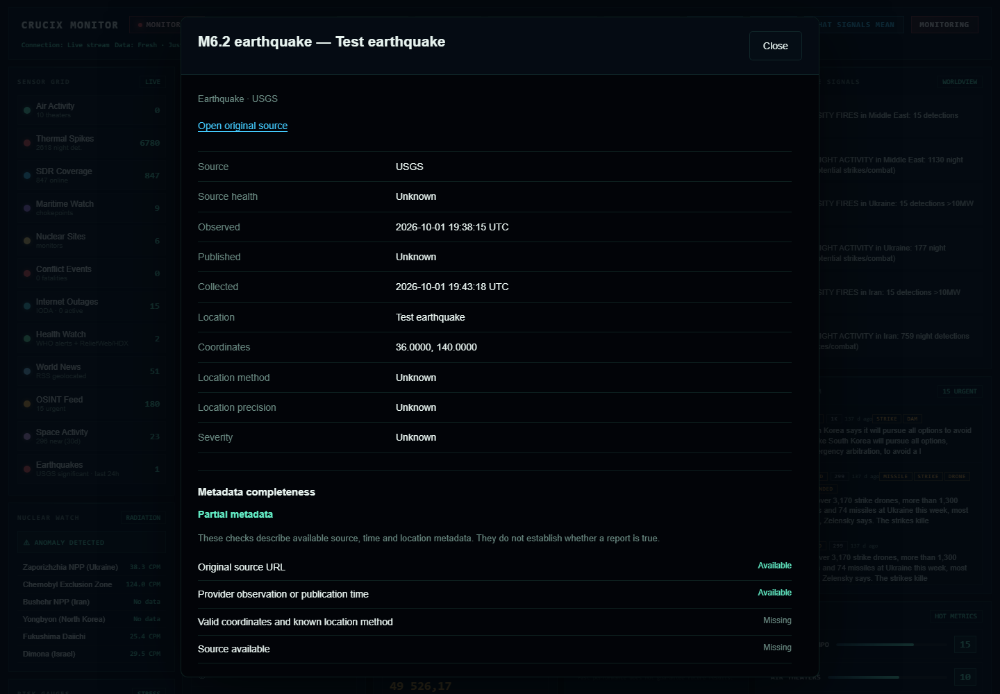
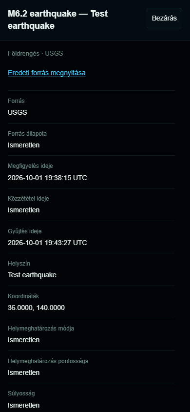
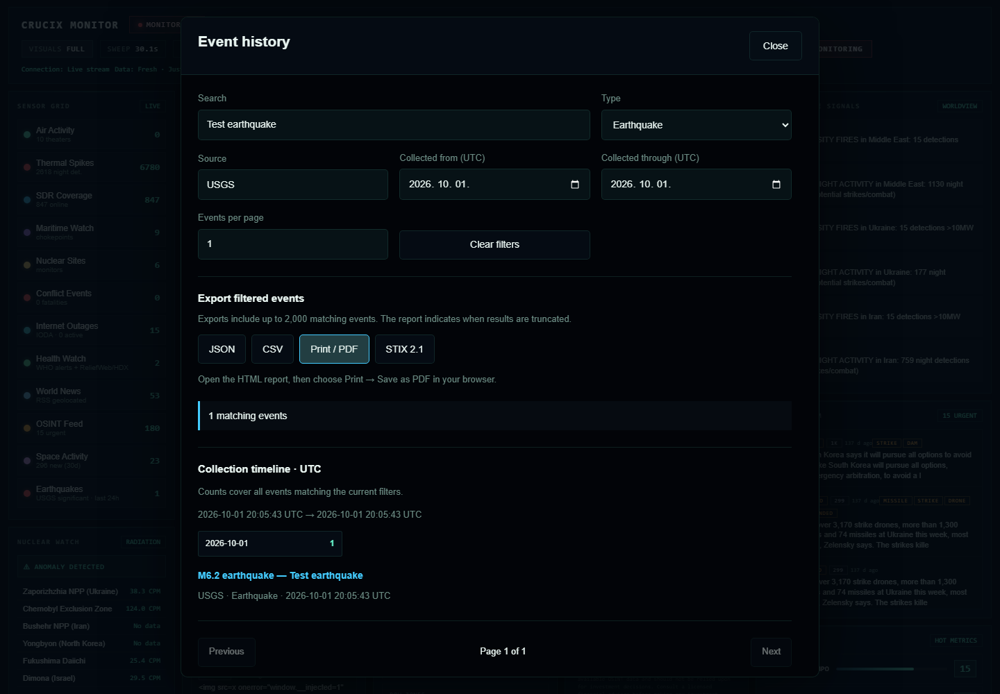
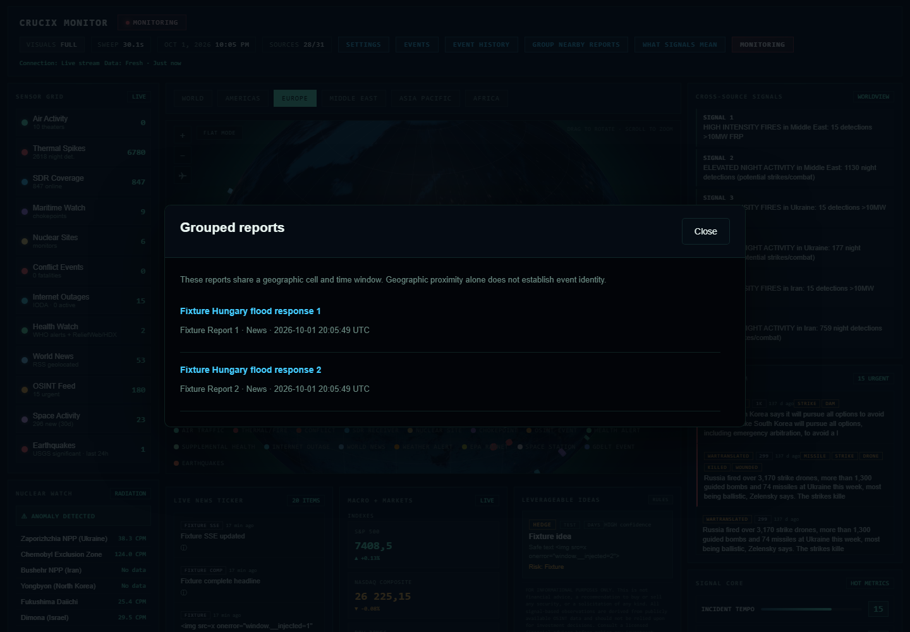
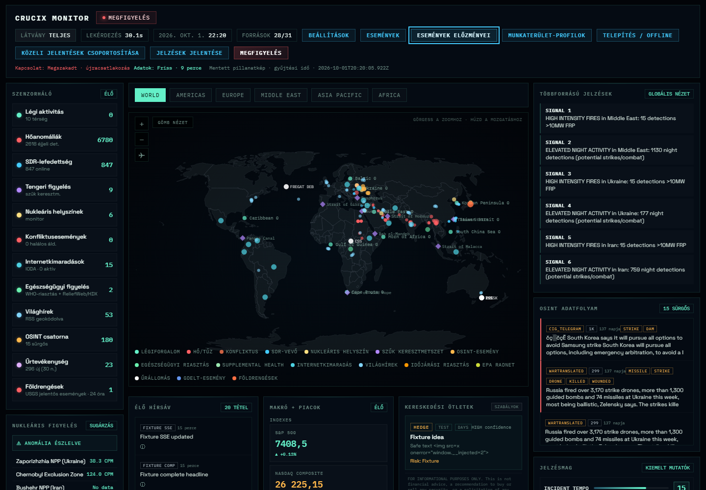
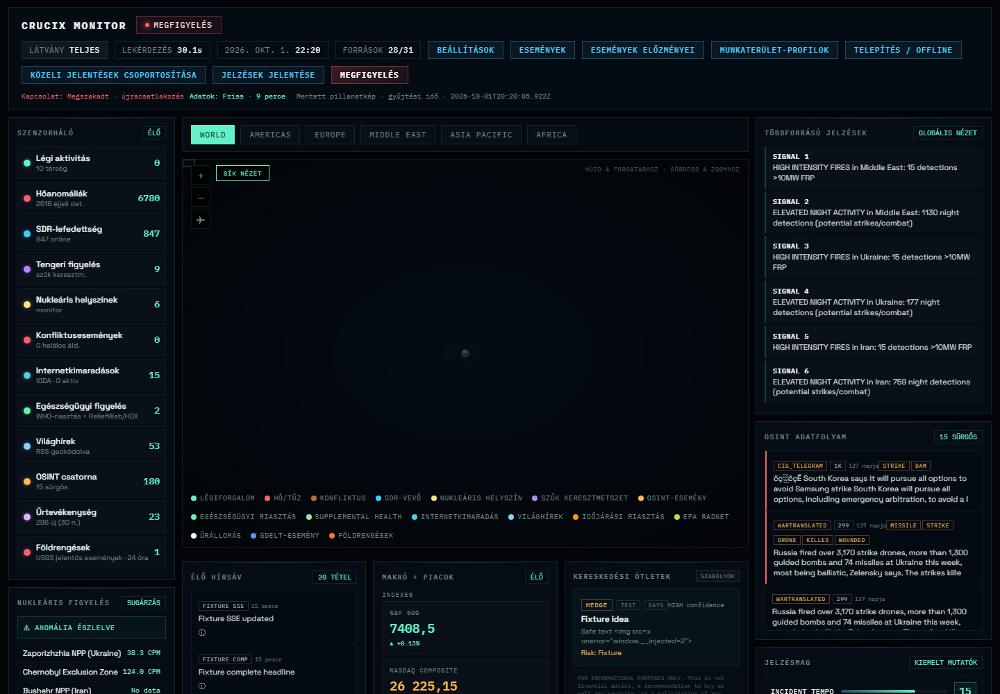
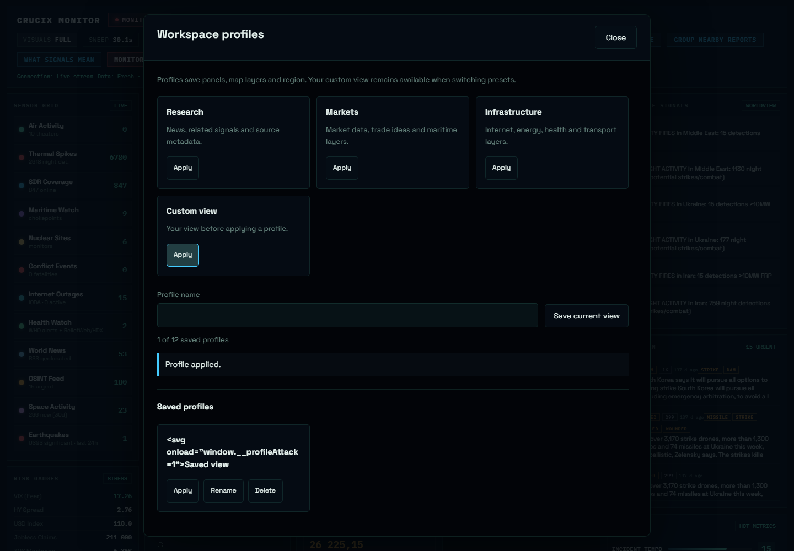
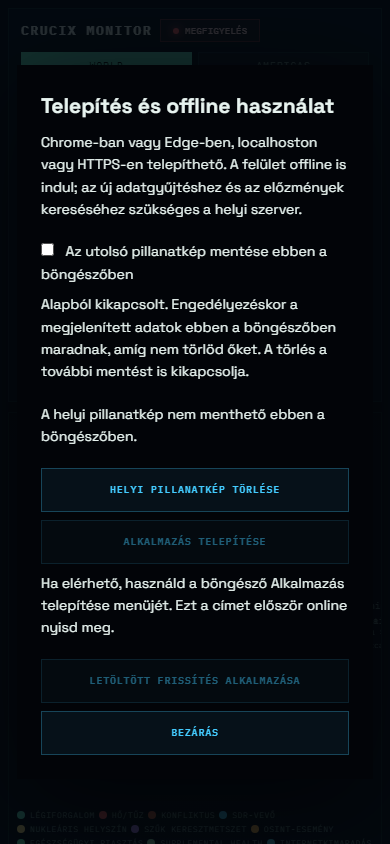

# Intelligence workspace verification — 2026-10-01

## 2.4 — Események / Events

- Kiadási fájlok tesztje: **182 teszt, 181 sikeres, 1 explicit opcionális skip**. Az eseménymodell 30 tesztje és a felület 18 DOM-viselkedési tesztje sikeres. JavaScript/locale, production dependency audit (0 ismert sérülékenység) és saját kód whitespace check sikeres; a vendor fájlok eredeti bájtjai megmaradnak.
- Valódi Chromium: eseménylista, hírszalag Enter, földrengésjelölő részletező, forráslink/idő/provenance, hostile text/link, fókuszcsapda, Escape/inert és fókusz-visszaállítás sikeres.
- 390×844 mobil: angol/magyar/francia részletező vízszintes túlcsordulás nélkül, belső görgetéssel. A meglévő teljes böngészős ellenőrzés is sikeres: 13 flat/globe réteg, valódi WebGL, beállítások, SSE reconnect, polling fallback, régi API-válasz verseny és blocked storage. Page/console error: 0; a szoftveres WebGL readback teljesítményüzenetei nem alkalmazáshibák.
- Reprodukálás: `node test/fixtures/dashboard-server.mjs`; másik terminálban `PLAYWRIGHT_MODULE` az opcionális Playwright telepítésre mutat, majd `node scripts/browser-qa.mjs` és `node scripts/intelligence-ui-qa.mjs`. Csak az azonosítható localhost fixture szolgál adatot; a provider/bot/modelleket nem terheli.

Validation uses a deterministic fixture, not live-source/account availability. Existing map/WebGL/SSE regression checks and the new accessible event flows pass.

## 2.5 — Történet/export/csoportok / History/export/groups

- **219 teszt: 218 pass, 1 explicit skip**; 31 journal/export viselkedési eset, HTTP auth/filter/HTML export, 32 eseménymodell- és 20 DOM-felületteszt.
- Valódi böngészős JSON/CSV/STIX letöltések, tartalom parse, q/kind/source/from/to szűrők megőrzése. HTML riportból Chromium valódi PDF-et generált; a termék a böngésző nyomtatását használja.
- Lapozás és ékezetes keresés, találatokhoz tartozó teljes idővonal, szűrők megőrzése részletezés után. Keresés utáni gombnyomást korábban elnyelő duplikált input/change kérés javítva és regresszióval védve.
- Tényleges síktérképes jelölőkattintás és földgömb canvas-kattintás nyitja a két külön forrású jelentéscsoportot; mindkét nézetben réteg- és csoportkapcsolás ellenőrizve. Ez rendezési funkció, nem automatikus megerősítés.
- [2.4 kiadás CI](https://github.com/mp3pintyo/Crucix/actions/runs/36916435943): mind a négy OS/Node kombináció, non-root írás és multiarch build/publikálás sikeres.

## 2.6 — Profilok és PWA / Profiles and PWA

- **225 teszt: 224 pass, 1 explicit opcionális skip, 0 fail**. 121 JavaScript-program, locale és 27 vendor asset hash/byte jegyzéke ellenőrizve. Production dependency audit: 0 ismert sérülékenység.
- Valódi Chromium/Playwright 1.62.1: a PWA alapból nem ment eseményadatot; fizikai kapcsolás után IndexedDB mentés, monoton idővédelem. Offline újratöltés helyi flat/globe térképpel és eseményekkel, mentettadat-/gyűjtésiidő-jelzés. Clear után új offline indulás üres és nem 1970-es dátumú. A cache-kulcsok között nincs élő HTML, API vagy SSE. Külső assetkérés és pageerror: 0.
- 390×844 mobil tiltott IndexedDB-vel: látható magyar hiba, visszaállított kapcsoló, Escape, túlcsordulás nélkül. Kutatás/piac/infrastruktúra profilok tényleges panel/réteg/régió állapota, előző egyéni nézet és elmentett profil újratöltés utáni visszaállítása ellenőrizve; tiltott localStorage mellett használható session fallback és fókusz-visszaállítás.
- A végső `QA_PHASE=all` futás a teljes detail/history/export/cluster/profile felületet ellenőrizte: HU/EN/FR mobil, valódi JSON/CSV/STIX letöltés/parse és Chromium PDF, lapozás, öt megtartott szűrő, flat/globe fizikai csoportkattintás, tároláshibák. Legacy CDN-kérés: 0.
- A teljes korábbi `browser-qa.mjs` regresszió a végső kódon is sikeres: 13 réteg, 54 valódi WebGL-pont, desktop/mobil beállítások, SSE reconnect, polling fallback, hibás API, snapshot-verseny, üres első indulás, mozgási preferencia és négy XSS-payload. Page/console error: 0; csak szoftveres WebGL readback teljesítményüzenet. Képek: [desktop](images/browser-2.6-desktop.png), [mobil](images/browser-2.6-mobile.png), [mobil beállítás](images/browser-2.6-mobile-settings.png).
- Független átnézés után regresszióval javítva: érvénytelen jövőbeli IDB-adat blokkolta a mentést, hibás store tranzakció DB-kapcsolatot hagyott nyitva, eltűnt waiting worker gombja későbbi akaratlan reloadot élesíthetett. Mindhárom javítva; a korábbi napló ID/URL/backup hibáinak tesztjei is megmaradnak.
- [2.5 kiadás CI](https://github.com/mp3pintyo/Crucix/actions/runs/36919349241): mind a négy Windows/Linux × Node22/24 minőségellenőrzés, non-root írás és multiarch konténerbuild/publikálás sikeres.
- Új konténerellenőrzés: az image-en belül futó `scripts/verify-assets.mjs` ellenőrzi a licencek/assetek meglétét és eredeti bájtjait; a `.dockerignore` megőrzi ezeket és a projekt licencét.

Reprodukálás a fenti fixture-rel: Playwright 1.62.1, `node scripts/browser-qa.mjs`; `QA_PHASE=all node scripts/intelligence-ui-qa.mjs`; `node scripts/pwa-qa.mjs`. PowerShellben a változó: `$env:QA_PHASE='all'`. A QA nem hív élő botot/modellt és nem bizonyít szolgáltatói account-hozzáférést. A telepíthetőség manifest/SW ellenőrzése sikeres; natív Windows wrapper vagy kézzel végzett böngésző-installáció nincs állítva.

The final workspace includes all three release batches. Browser validation uses an isolated local fixture. Offline restoration, cleared-data startup, preset/custom profile behavior, real exports and accessibility are covered without operator credentials.
